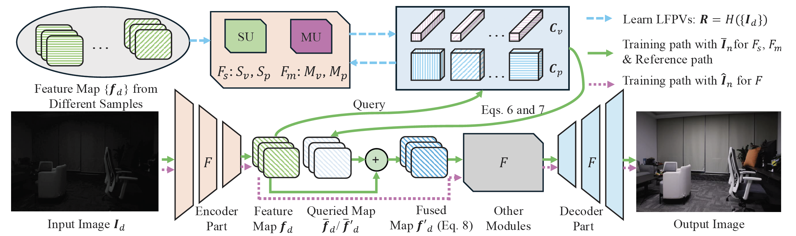

# Learnable Feature Patches and Vectors for Boosting Low-light Image Enhancement without External Knowledge

This is a pytorch project for the paper **Learnable Feature Patches and Vectors for Boosting Low-light Image Enhancement without External Knowledge** by Xiaogang Xu, Jiafei Wu, Qingsen Yan, Jiequan Cui, Richang Hong, and Bei Yu presented at **ICCV2025**.


## Introduction
This paper proposes to utilize the hidden knowledge in the training dataset to improve the low-light image enhancement performance. Our strategy simultaneously learns image-specific features by neural networks while formulating effective common features from the training data as the reference. These common features are correlated with the samples that are not fully fitted by the LLIE network itself, and they are represented as a set of Learnable Feature Patches and Vectors (LFPVs) in the hidden feature space. LFPVs are updated through two mechanisms: the sampleupdater, which extracts useful features from training samples to refine LFPVs, and the mutual-updater, which propagates information across LFPVs to mutually update them. LFPVs can be adaptively aligned with image-specific features via our designed query-and-fusion procedure, boosting the LLIE performance.



[paper link](https://openaccess.thecvf.com/content/CVPR2024/papers/Xu_Boosting_Image_Restoration_via_Priors_from_Pre-trained_Models_CVPR_2024_paper.pdf)


## Project Setup

First install Python 3. We advise you to install Python 3 and PyTorch with Anaconda:

```
conda create --name py36 python=3.6
source activate py36
```

Clone the repo and install the complementary requirements:
```
cd $HOME
git clone --recursive git@github.com:xiaogang00/LFPVS.git
cd LFPVS
pip install -r requirements.txt
```

## Usage

### Train

First, download the dataset. Take the dataset of SMID in the low-light image enhancement task as an example. 
For SMID, we use its full images and also transfer the RAWdata to RGB, since our work explores low-light image enhancement in the RGB domain.
You can download our processed datasets for SMID from [baidu pan](https://pan.baidu.com/s/1Qol_4GsIjGDR8UT9IRZbBQ) (验证码: btux) 
(the dataset can also be downloaded from [google pan](https://drive.google.com/drive/folders/1OV4XgVhipsRqjbp8SYr-4Rpk3mPwvdvG?usp=sharing)), and there should contain "SMID_Long_np and SMID_LQ_np".

Train the model on the corresponding dataset using the train config.
For example, the training on SMID:
```
python -m torch.distributed.launch --nproc_per_node 1 --master_port 4377 train.py -opt options/train/SMID.yml --launcher pytorch
```

### Test

We use PSNR and SSIM as the metrics for evaluation. Evaluate the model on the corresponding dataset using the test config.

For instance, for the evaluation on SMID, you can download the pretrained model on SMID (the link is https://drive.google.com/file/d/1n4LiRQMzwKfz5S36lmdvN_i7OqifFcLe/view?usp=sharing) or use the trained model by yourself, writing the location of checkpoint in ``pretrain_model_G" of options/test/SMID.yml
use the following command line:
```
python test.py -opt options/test/SMID.yml
```

Since our model is trained and stored on machines owned by one company, some models and configurations are currently unavailable due to that company's security requirements and other regulations.

## Citation Information

If you find the project useful, please cite:

```
@inproceedings{xu2025lfpvs,
  title={Learnable Feature Patches and Vectors for Boosting Low-light Image Enhancement without External Knowledge},
  author={Xu, Xiaogang and Wu, Jiafei and Yan, Qingsen and Cui, Jiequan and Hong, Richang and Yu, Bei},
  booktitle={ICCV},
  year={2025}
}
```

## Contributions
If you have any questions/comments/bug reports, feel free to e-mail the author Xiaogang Xu ([xiaogangxu00@gmail.com](xiaogangxu00@gmail.com)).
